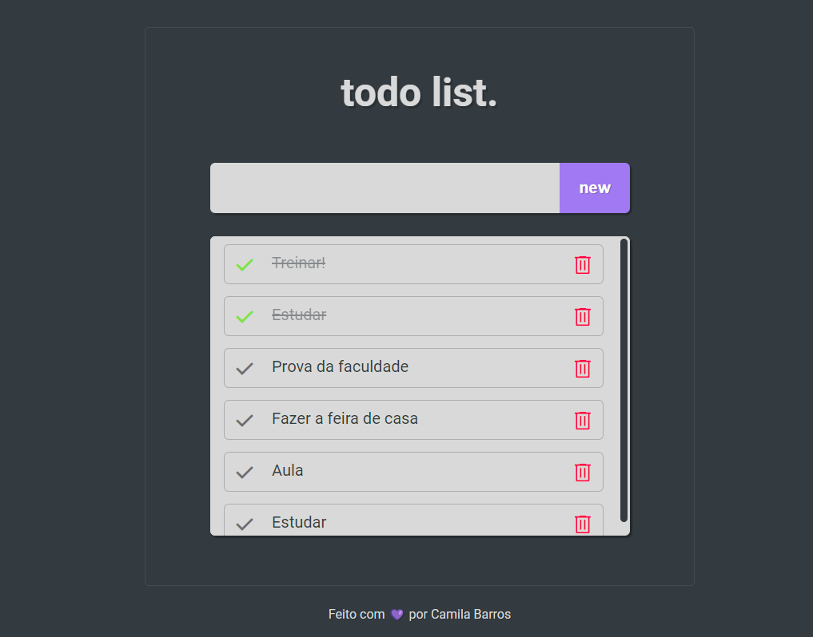

    

## 🖥️ Projeto
Esse é um Miniprojeto Web de uma "To Do List", no qual é possível adicionar, concluir e deletar tarefas simples. 

## 🚀 Tecnologias
Esse projeto foi desenvolvido utilizando as seguintes tecnologias:

- HTML
- CSS
- JavaScript
- Git e Github

